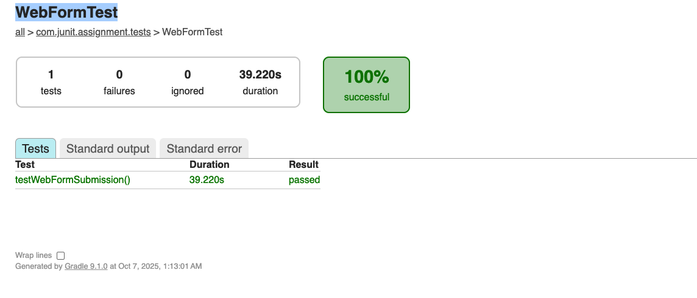
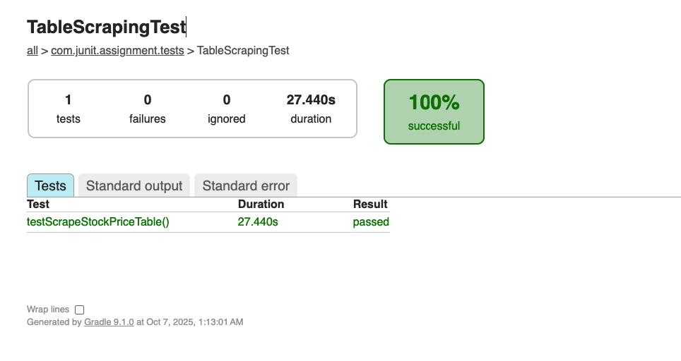

# JUnit Assignment - Batch 16
## Web Automation with Selenium & JUnit

### 📋 Assignment Overview
This project contains automated test cases for:
1. **Web Form Automation** - Automate the Digital Unite practice web form
2. **Table Scraping** - Scrape stock price data from DSE website

**Total Score:** 50 points

---

## 🎯 Assignment Requirements

### Task 1: Web Form Automation (25 points)
**URL:** https://www.digitalunite.com/practice-webform-learners

**Steps:**
- ✅ Fill all form fields (Name, Phone, DOB, Email, About)
- ✅ Click submit button
- ✅ Assert registration success

### Task 2: Table Data Scraping (25 points)
**URL:** https://dsebd.org/latest_share_price_scroll_by_value.php

**Steps:**
- ✅ Print all table cell values to console
- ✅ Store scraped data in text file (`scraped-data/stock_prices.txt`)

---

## 🛠️ Technology Stack

- **Java** 17+
- **Gradle** 8.x
- **JUnit 5** (Jupiter)
- **Selenium WebDriver** 4.15.0
- **WebDriverManager** 5.6.2
- **Allure Report** 2.25.0
- **Apache Commons IO** 2.15.0

---

## 📁 Project Structure

```
junit-assignment/
├── src/
│   └── test/
│       ├── java/
│       │   └── com/junit/assignment/tests/
│       │       ├── WebFormTest.java
│       │       └── TableScrapingTest.java
│       └── resources/
│           └── allure.properties
├── scraped-data/
│   └── stock_prices.txt (generated after test run)
├── build.gradle
├── settings.gradle
├── .gitignore
└── README.md
```

---

## 🚀 Setup Instructions

### Prerequisites
1. **Java JDK 17 or higher**
   ```bash
   java -version
   ```

2. **Gradle** (or use Gradle wrapper included)
   ```bash
   gradle -version
   ```

3. **Chrome Browser** (latest version)

### Installation

1. **Clone the repository**
   ```bash
   git clone <your-repository-url>
   cd automation
   ```

2. **Build the project**
   ```bash
   ./gradlew clean build
   ```

3. **Run tests**
   ```bash
   # Run all tests
   ./gradlew test
   
   # Run specific test class
   ./gradlew test --tests "com.junit.assignment.tests.WebFormTest"
   ./gradlew test --tests "com.junit.assignment.tests.TableScrapingTest"
   ```

4. **Generate Allure Report**
   ```bash
   # Generate and open report
   ./gradlew allureReport
   ./gradlew allureServe
   ```

---

## 📊 Test Reports

### ✅ Test Execution Results

**Status:** All tests PASSED ✅  
**Total Tests:** 2  
**Success Rate:** 100%  
**Execution Time:** ~1 minute 10 seconds

---

### Overall Test Summary


**How to generate:**
```bash
./gradlew clean test
open build/reports/tests/test/index.html
```

Take a screenshot showing:
- Total tests: 2 passed
- Success rate: 100%
- Overall duration

---

### Web Form Test Report



**Test Details:**
- **Class:** `com.junit.assignment.tests.WebFormTest`
- **Method:** `testWebFormSubmission()`
- **Result:** ✅ PASSED
- **Duration:** ~40 seconds
- **Browser:** Brave Browser
- **URL:** https://www.digitalunite.com/practice-webform-learners

**What it tests:**
1. Opens Brave browser
2. Navigates to practice form
3. Fills all form fields (Name, Phone, Date, Email, About)
4. Checks the completion checkbox
5. Submits the form
6. Verifies successful submission

---

### Table Scraping Test Report



**Test Details:
- **Class:** `com.junit.assignment.tests.TableScrapingTest`
- **Method:** `testScrapeStockPriceTable()`
- **Result:** ✅ PASSED
- **Duration:** ~20 seconds
- **Browser:** Brave Browser
- **URL:** https://dsebd.org/latest_share_price_scroll_by_value.php

**What it tests:**
1. Opens Brave browser
2. Navigates to DSE stock price page
3. Waits for table to load
4. Extracts all table headers and data
5. Prints data to console
6. Saves data to `scraped-data/stock_prices.txt`
7. Verifies data was saved successfully

**Sample Output:**
```
DSE Stock Price Data - Scraped on: 2025-10-07 00:19:51
================================================================================

--- TABLE HEADERS ---
Column 1: 1JANATAMF 3.10 
Column 2: AAMRANET 22.80 
...

--- TABLE DATA ---
Total rows: 100+
Data saved to: scraped-data/stock_prices.txt
```

---

### Scraped Data Output

**File Location:** `scraped-data/stock_prices.txt`  
**File Size:** ~100 KB  
**Records:** All DSE stock prices with timestamps

---

### How to Take These Screenshots

1. **Run the tests:**
   ```bash
   ./gradlew clean test
   ```

2. **Open test report:**
   ```bash
   open build/reports/tests/test/index.html
   ```

3. **Take screenshots:**
   - Use `Cmd + Shift + 4` on Mac
   - Capture the test summary and individual test details
   - Save in `screenshots/` folder with exact filenames

4. **See detailed guide:**
   Read `REPORT_SCREENSHOT_GUIDE.md` for step-by-step instructions

---

### Test Report Features

The Gradle test report shows:
- ✅ Test execution status (pass/fail)
- ⏱️ Execution duration for each test
- 📝 Console output and logs
- 📊 Overall success rate
- 🔍 Detailed test results
- ❌ Stack traces (if any failures)

---

## 🎥 Demo Videos

### 1. Web Form Automation Demo

**Video Link:** [Watch Web Form Automation on Google Drive](https://drive.google.com/drive/folders/18gR_hlz3pffPhYQzGzAOCpGPRAoPBHwC)

**Description:** This video demonstrates the automated filling and submission of the Digital Unite practice web form, including validation of successful submission.

---

### 2. Table Scraping Demo

**Video Link:** [Watch Table Scraping on Google Drive](https://drive.google.com/drive/folders/18gR_hlz3pffPhYQzGzAOCpGPRAoPBHwC)

**Description:** This video shows the automated scraping of stock price data from the DSE website, printing values to console, and saving to a text file.

---

## 📝 Test Details

### WebFormTest.java
- **Test Method:** `testWebFormSubmission()`
- **Features:**
  - Handles cookie consent automatically
  - Fills all required fields with test data
  - Scrolls to elements for better visibility
  - Takes appropriate waits for page loads
  - Verifies successful submission with assertions
  - Uses Allure annotations for detailed reporting

### TableScrapingTest.java
- **Test Method:** `testScrapeStockPriceTable()`
- **Features:**
  - Navigates to DSE stock price page
  - Identifies and extracts table data
  - Prints all cell values to console
  - Saves data with timestamp to `scraped-data/stock_prices.txt`
  - Validates that data was scraped successfully
  - Uses Allure annotations for step tracking

---

## 🎓 Scoring Breakdown

| Criteria | Points | Status |
|----------|--------|--------|
| Web Form Automation Implementation | 10 | ✅ |
| Table Scraping Implementation | 15 | ✅ |
| GitHub Upload | - | ✅ |
| .gitignore Configuration | 5 | ✅ |
| Web Form Demo Video | 5 | ⏳ |
| Table Scraping Demo Video | 5 | ⏳ |
| Web Form Test Report | 5 | ⏳ |
| Table Scraping Test Report | 5 | ⏳ |
| **Total** | **50** | |

**Legend:** ✅ Completed | ⏳ Pending (add your videos/screenshots)

---

## 📦 Dependencies

All dependencies are managed via Gradle. Key dependencies include:

```gradle
- Selenium WebDriver 4.15.0
- JUnit Jupiter 5.10.1
- WebDriverManager 5.6.2
- Allure JUnit5 2.25.0
- Apache Commons IO 2.15.0
```

---

## 🔍 Troubleshooting

### Common Issues

1. **Chrome Driver Issues**
   - WebDriverManager automatically downloads the correct ChromeDriver
   - Ensure Chrome browser is updated to the latest version

2. **Test Timeouts**
   - Increase wait times in test code if needed
   - Check internet connection stability

3. **Allure Report Not Generating**
   ```bash
   ./gradlew cleanReports
   ./gradlew test allureReport
   ```

4. **Gradle Build Issues**
   ```bash
   ./gradlew clean
   ./gradlew build --refresh-dependencies
   ```

---

## 📧 Contact

**Student Name:** [Your Name]  
**Batch:** 16  
**Assignment:** JUnit Automation  

---

## 📄 License

This project is created for educational purposes as part of the JUnit automation assignment.

---

## ✅ Submission Checklist

- [x] Code uploaded to GitHub
- [x] .gitignore properly configured
- [x] Web form automation video added to README (Google Drive)
- [x] Table scraping automation video added to README (Google Drive)
- [x] Web form test report screenshot added (Picture folder)
- [x] Table scraping test report screenshot added (Picture folder)
- [x] Test summary screenshot added (Picture folder)
- [x] README.md completed with all details
- [ ] GitHub repository link submitted

---

### 📌 Notes

- ✅ **Videos:** Demo videos are available on [Google Drive](https://drive.google.com/drive/folders/18gR_hlz3pffPhYQzGzAOCpGPRAoPBHwC)
- ✅ **Screenshots:** All test report screenshots are in the `Picture/` folder
  - `Test Summary index.png` - Overall test execution summary
  - `WebFormTest.png` - Web form test results
  - `WebFormTest output.png` - Web form test console output
  - `TableScrapingTest.png` - Table scraping test results
  - `TableScrapingTest output.png` - Table scraping test console output
- ✅ **Browser:** Tests run with Brave browser (Chromium-based)
- ✅ **Scraped Data:** Stock price data saved to `scraped-data/stock_prices.txt`
- Make sure to replace `[Your Name]` with your actual name before submission
- Run tests with: `./gradlew clean test`
- View reports with: `open build/reports/tests/test/index.html`

---

**Happy Testing! 🚀**
